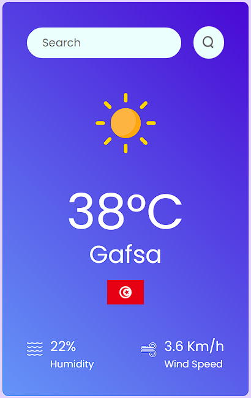

# Weather App
A ReactJS-based weather application that provides current weather data for any city using the [OpenWeatherMap](https://openweathermap.org/) API and [Flags](https://flagsapi.com/) API. The app displays temperature, weather conditions, humidity, wind speed, and the country flag of the specified location.

## Features
* **Weather Data :** Displays the current weather including temperature, weather conditions, humidity, and wind speed.
* **Search Functionality:** Allows users to search for weather information by entering a city name.
* **Dynamic Weather Icons:** Displays icons that correspond to the current weather conditions (e.g., clear, rain, snow).
* **Country Flags:** Shows the country flag of the searched location.

## Getting Started
#### Prerequisites :
* Node.js and npm installed on your machine.

#### Installation :
1. **Clone the repository:**
    ```bash
    git clone https://github.com/Adlichalbi/React-weather-app.git
    cd React-weather-app
    ```
2. **Install dependencies:**
    ```bash
    npm install
    ```
3. **Set up environment variables:**
    * Create a `.env` file in the root of the project.
    * Add your OpenWeatherMap API Key:
    ```env
    VITE_KEY_Weather=your_openweathermap_api_key
    ```
4. **Start the development server:**
    ```bash
    npm run dev
    ```
5. **Access the app:**  
    * Open your browser and go to `http://localhost:3000`
    
### Usage
1. **Search for a city:** Enter the city name in the search bar and press `Enter` or click the search icon.    
2. **View weather details:** The app will display the current temperature, weather icon, city name, country flag, humidity, and wind speed.

## Screenshots


## Technologies Used
* **ReactJS:** Frontend Framework
* **CSS:** Styling the application
* **OpenWeatherMap API:** Fetching weather data
* **Flags API:** Displaying country flags based on the location

### License
This project is licensed under the MIT License.

### Contributing
Contributions are welcome! Please fork this repository and submit a pull request if you'd like to make improvements or add features.

### Contact
For any questions or feedback, please contact [Adli Chalbi](https://github.com/Adlichalbi)